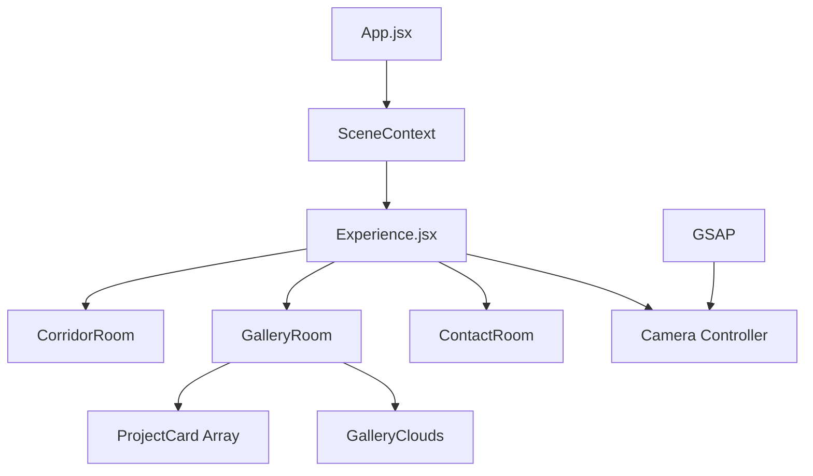

# 🎨 Immersive 3D Architectural Portfolio
### *A fusion of Art, Code, and Spatial Design*

[](https://vitejs.dev/)
[](https://reactjs.org/)
[](https://threejs.org/)
[](https://greensock.com/)

---

## 📽️ Project Overview

This is not just a website; it's a **digital exhibition**. Built with **React Three Fiber**, this portfolio takes users through a sequence of hand-crafted 3D environments. Every transition, shader, and interaction is designed to feel tactile and cinematic.

### [🚀 Explore Live Demo](https://abhi-portfolio.vercel.app/)

---

## 🌌 The Architectural Journey

### 1. The Entrance & Corridor
- **Architectural Depth:** Custom-built 3D corridor with realistic depth cues and vanishing point perspective.
- **Dynamic Lighting:** Real-time PointLights and MeshStandardMaterials creating a premium "Studio" atmosphere.
- **Cinematic Fly-in:** A seamless transition from the entrance doors into the heart of the portfolio.

### 2. The Infinite Gallery (New!)
- **Auto-Scroll Engine:** An intelligent infinite-scroll system that advances projects automatically.
- **Interactive Exhibit:** Projects hang on a physics-inspired 3D clothesline system.
- **Tactile Interaction:** Users can "inspect" cards, triggering smooth 3D rotations and scale animations.
- **Smart Pause:** Auto-animation intelligently pauses during user interaction (scroll/drag/click) and resumes after 3 seconds of inactivity.

### 3. Sky Labeling & Achievement Clouds
- **Floating Milestones:** Key professional statistics are embedded directly into the 3D sky.
- **Stationary Cloud HUD:** A specialized cloud in the top-right sky displays "30+ Projects Done" in a sketchy, integrated font.

---

## 🛠️ Technical Deep Dive

### 🎨 Custom Shaders & Materials
- **PaperMaterial:** A custom shader implementation that mimics high-quality paper texture with grain and fiber details.
- **Paint-Stroke Transition:** A unique "Paint" shader that reveals the room as if it's being painted live onto a canvas.
- **MeshReflectorMaterial:** High-fidelity floor reflections that adapt based on the user's hardware tier.

### ⚙️ Performance Engineering
- **Tier-Based Optimization:** Automatically adjusts reflection resolution, light counts, and shadow quality based on device capabilities.
- **Adaptive Frame Rate:** Uses `useFrame` with delta-smoothing for consistent animation speed regardless of monitor refresh rate.
- **Lazy Preloading:** Strategic texture preloading to prevent stuttering while moving between 3D rooms.

### 🎼 Spatial Audio System
- **3D Positional Audio:** Sounds like "City Ambience" and "Paper Flips" are panned in 3D space relative to the camera position.
- **Global Audio Manager:** Centralized control for muting and volume leveling across the entire experience.

---

## 🧪 Tech Stack

| Category | Technology |
| :--- | :--- |
| **Core** | React 19, Vite, JavaScript (ES6+) |
| **3D Rendering** | Three.js, React Three Fiber, @react-three/drei |
| **Animation** | GSAP (GreenSock), ScrollTrigger, Observer |
| **Post-Processing** | Bloom, Vignette, Noise Shaders |
| **Styling** | SASS/SCSS, Vanilla CSS |
| **Data Tracking** | PostHog (Telemetry) |

---

## 📂 Project Architecture



---

## 🏁 Setup & Installation

### 1. Clone the repository
```bash
git clone https://github.com/abhi96256/abhi-portfolio.git
```

### 2. Install Dependencies
```bash
npm install
```

### 3. Run Development Server
```bash
npm run dev
```

### 4. Build for Production
```bash
npm run build
```

---

## 👤 About the Developer

**Abhishek Kumar** — *Full Stack Developer & 3D Enthusiast*

I specialize in creating high-end digital experiences that bridge the gap between design and technology. With 2+ years of experience and 30+ projects delivered globally, I focus on performance, aesthetics, and user delight.

- 🌐 [Portfolio](https://abhi-portfolio-indol.vercel.app/)
- 🐙 [GitHub](https://github.com/abhi96256)
- 💼 [LinkedIn](https://www.linkedin.com/in/abhishek-kumar-326939291/)

---

<div align="center">
  
  <p><i>Building the future of the web, one pixel at a time.</i></p>
</div>
